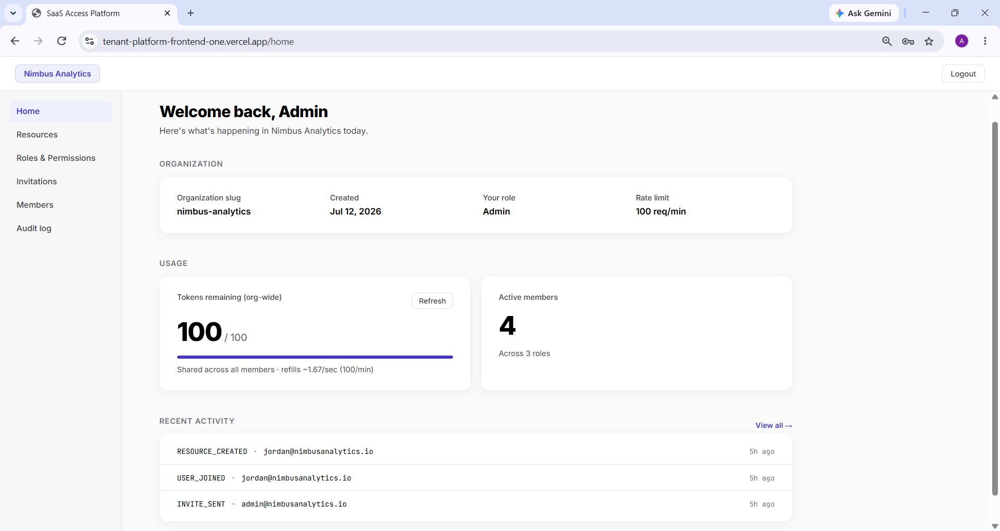
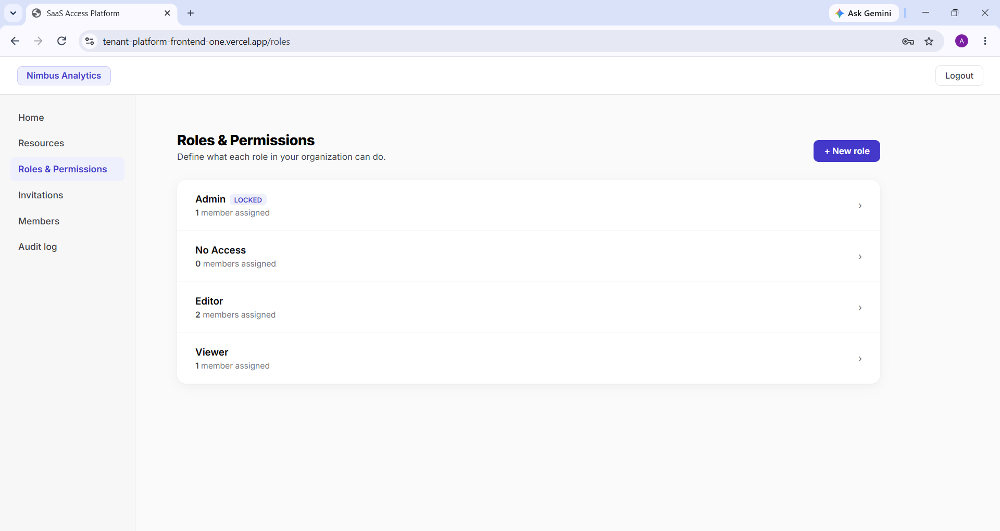
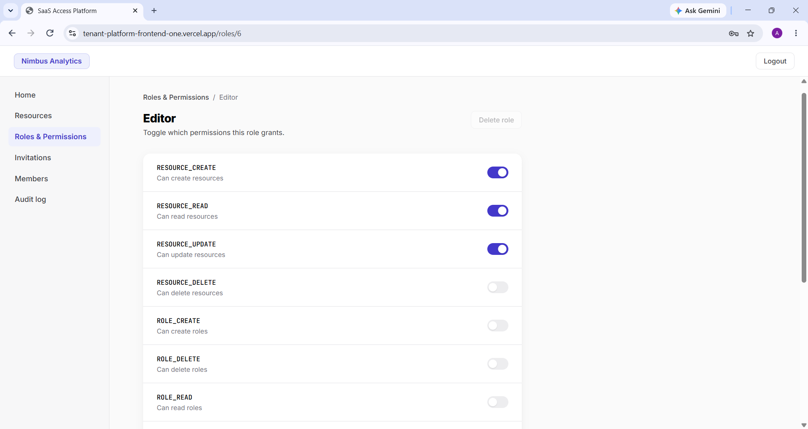
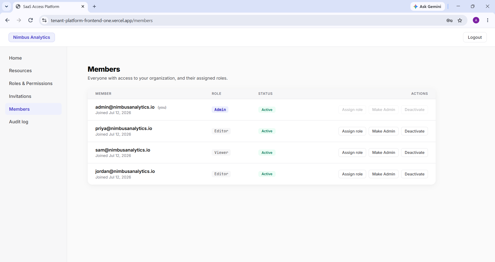
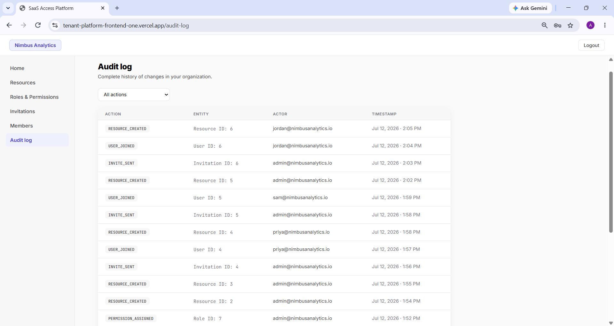

# Multi-Tenant Access Management Platform with Rate Limiting

A backend platform demonstrating production-grade patterns for multi-tenant SaaS systems —
complete data isolation across three independent layers, data-driven role-based access control,
and per-organization API rate limiting backed by Redis. Multiple organizations share the same
application and database, with no organization able to see or affect another's data, even
if a query is missed somewhere or a client sends a malformed request.

Built with Java 21, Spring Boot 3.4.5, Spring Security, Redis, and React.

For the reasoning behind the key architectural and product decisions in this project, see
[`docs/design-decisions.md`](docs/design-decisions.md). For the full API contract, see
[`docs/api-reference.md`](docs/api-reference.md).

---

## Table of Contents

- [Screenshots & Live Demo](#screenshots--live-demo)
- [Tech Stack](#tech-stack)
- [Key Features](#key-features)
- [Architecture](#architecture)
  - [Tenant Isolation](#tenant-isolation)
  - [Request Pipeline](#request-pipeline)
  - [RBAC Model](#rbac-model)
  - [Admin Governance](#admin-governance)
  - [Invitation Flow](#invitation-flow)
  - [Rate Limiting](#rate-limiting)
- [Database Schema](#database-schema)
- [Getting Started](#getting-started)
  - [Prerequisites](#prerequisites)
  - [Local Setup](#local-setup)
  - [Configuration](#configuration)
- [API Overview](#api-overview)
- [Testing](#testing)
- [Deployment](#deployment)
- [Known Limitations](#known-limitations)
- [Project Structure](#project-structure)
- [Further Reading](#further-reading)

---

## Screenshots & Live Demo


*Home — organization overview, live rate-limit usage, and recent activity at a glance.*



*Roles & Permissions — every role in the organization, with member counts and lock status for system roles.*



*Role detail — individual permission toggles, showing a custom role with a deliberately partial permission set.*



*Members — role assignments, active status, and per-member management actions.*



*Audit Log — a complete, timestamped history of every mutation in the organization.*

**Live demo:**
- Frontend: https://tenant-platform-frontend-one.vercel.app
- Backend health check: https://tenant-platform-backend.onrender.com/actuator/health

There's no open registration for individual users by design — the platform is invitation-only
once an organization exists. To try it, register a new organization from the frontend; that
creates an Admin account for you and takes about thirty seconds. The backend runs on Render's
free tier, so the first request after a period of inactivity can take 30–60 seconds to respond
while the instance spins back up. Subsequent requests are fast.

---

## Tech Stack

| Layer | Technology |
|---|---|
| Language | Java 21 |
| Framework | Spring Boot 3.4.5 |
| Security | Spring Security, JWT (HS384), BCrypt |
| Persistence | Spring Data JPA, Hibernate, MySQL |
| Rate Limiting | Redis, atomic Lua script, token bucket algorithm |
| Frontend | React (Vite), Axios |
| Infrastructure | Docker, Docker Compose, Render, Aiven (MySQL + Valkey), Vercel |
| Testing | JUnit 5, Spring Boot Test, MockMvc |

---

## Key Features

- Multi-tenant architecture with a shared schema and complete row-level data isolation
- JWT-based stateless authentication with org-scoped token claims
- Data-driven RBAC — organizations define custom roles and assign permissions at runtime, with
  no code change required
- Invitation-based user onboarding with single-use tokens and a 48-hour expiry
- Immutable audit logging for every mutation, applied automatically via AOP
- Per-organization rate limiting using a Redis-backed token bucket, enforced atomically through
  a Lua script
- A self-service usage endpoint so any authenticated user can check their organization's
  remaining quota without spending one
- A self-service organization endpoint so the frontend can render real org metadata without
  hardcoding it

---

## Architecture

### Tenant Isolation

Isolation is enforced across three independent layers, so that a gap in any single one still
leaves the other two in place.

A Hibernate `@Filter`, enabled at the session level before any repository call runs, applies
`WHERE org_id = :orgId` automatically to every query against a tenant-scoped table. On top of
that, every fetch-by-ID goes through `findByIdAndOrgId` rather than a plain `findById` — if the
record exists but belongs to a different organization, the service treats it as not found and
returns a 404, not a 403 (see `docs/design-decisions.md` for why that distinction matters).
Finally, the org context itself is never something a client can influence: it's read exclusively
from the JWT principal, and no endpoint accepts `orgId` as a request field or query parameter.

### Request Pipeline

```
HTTP Request
    |
JwtAuthFilter        — validates the JWT, builds the security principal
    |
RateLimitFilter      — checks the org's token bucket in Redis, rejects with 429 if exhausted
    |
TenantFilter         — extracts orgId from the JWT, sets tenant context for this request
    |
Hibernate Filter     — enabled via AOP before any repository call
    |
@PreAuthorize        — CustomPermissionEvaluator resolves userId -> role -> permission
    |
Service Layer        — business logic; orgId always comes from the security context
    |
AuditAspect          — logs the mutation after a successful response
```

Rate limiting runs immediately after authentication, before tenant context or any business logic
executes. This is deliberate fail-fast ordering: a request that's going to be rejected for
exceeding its quota should be rejected as early as possible, before the system does any further
work on it.

### RBAC Model

Roles and permissions are runtime data rather than hardcoded roles, resolved on every request as
`userId -> role -> permission`, enforced through a custom `PermissionEvaluator` wired into
`@PreAuthorize`. The permission catalog currently holds 13 codes covering resources, roles,
permissions, users, invitations, admin transfer, and audit visibility.

| Code | Description |
|---|---|
| RESOURCE_CREATE | Create resources |
| RESOURCE_READ | Read resources |
| RESOURCE_UPDATE | Update resources |
| RESOURCE_DELETE | Delete resources |
| ROLE_CREATE | Create roles |
| ROLE_DELETE | Delete roles |
| ROLE_READ | Read roles |
| ROLE_MANAGE | Assign/unassign roles to and from users |
| PERMISSION_MANAGE | Add/remove permissions on a role |
| ADMIN_TRANSFER | Transfer admin ownership to another user |
| USER_INVITE | Send, list, and revoke invitations |
| USER_DEACTIVATE | Deactivate a user |
| AUDIT_VIEW | View audit logs |

### Admin Governance

Every organization is bootstrapped with two system roles: **Admin**, holding all 13 permissions,
and **No Access**, holding none. Both are immutable and undeletable — no endpoint will modify
either role's permission set or delete either role, regardless of caller. There is exactly one
Admin per organization at all times, and the role moves by an explicit transfer operation rather
than direct assignment: `transferAdmin` promotes the incoming Admin, assigns No Access to the
outgoing one, and removes their Admin role, all inside a single transaction, so the organization
is never left without an Admin, even momentarily. Permissions are re-checked against the database
on every request rather than trusted from the JWT, which is what makes a transfer take effect
immediately rather than only after the outgoing Admin's token expires — see
`docs/design-decisions.md` for why that trade-off was made deliberately.

### Invitation Flow

```
Admin calls POST /api/invitations
    |
System creates an Invitation row — token, 48hr expiry, status PENDING
    |
Token is returned in the API response (no email delivery in this project)
    |
Invitee calls POST /api/auth/accept-invitation with the token and a chosen password
    |
Validate token -> create User -> create UserRole -> mark Invitation ACCEPTED
    |
JWT returned immediately — the invitee is logged in without a separate login call
```

Both `sendInvitation` and `acceptInvitation` independently reject an invitation targeting the
Admin role — a gap that existed briefly during development and is covered in more detail in
`docs/design-decisions.md`.

### Rate Limiting

Each organization has a token bucket in Redis, sized to its `requestLimitPerMinute` (100 by
default). Tokens refill continuously at `limit / 60` per second rather than resetting all at once
on a fixed interval, and every incoming request consumes one token; once the bucket is empty, the
request is rejected with `429 Too Many Requests` and a `Retry-After` header.

The read, refill calculation, limit check, and decrement all happen inside a single Lua script
executed atomically on Redis, which is what prevents two concurrent requests for the same
organization from both reading the token count before either writes back the decremented value.
`GET /api/usage` is explicitly excluded from this limit, since checking remaining quota shouldn't
cost quota.

---

## Database Schema

| Table | Purpose |
|---|---|
| organizations | Tenant root — name, slug, status, requestLimitPerMinute |
| users | Scoped per organization — email is unique per org, not globally |
| roles | Org-scoped custom roles |
| permissions | Global permission catalog (system-level, not org-scoped) |
| role_permissions | Maps permissions to roles |
| user_roles | Maps roles to users |
| resources | Tenant-scoped business objects — name, optional description, owner |
| invitations | Token-based invite flow with a 48-hour expiry and single-use enforcement |
| audit_logs | Immutable, append-only change history |

Rate-limit state is not persisted in MySQL. Token counts and refill timestamps live entirely in
Redis, since that data is ephemeral by nature — if Redis restarts, every organization simply
starts with a full bucket again.

---

## Getting Started

### Prerequisites

- Java 21 (JDK)
- Maven (or use the bundled `./mvnw` wrapper — no separate install needed)
- Node.js 18+ and npm
- Docker and Docker Compose, for local MySQL and Redis

### Local Setup

```bash
# from the repository root — starts local MySQL and Redis via Docker Compose
docker compose up -d

# backend
cd backend
./mvnw spring-boot:run
```

The backend runs against `application.yml` (the default profile) — local MySQL on `3306`, local
Redis on `6379`. Schema objects are created automatically on startup, and `data.sql` seeds the
fixed permission catalog and system roles so the application has something to bootstrap new
organizations against.

```bash
# frontend, in a separate terminal
cd frontend
npm install
npm run dev
```

With no `VITE_API_URL` set, the frontend falls back to `http://localhost:8080/api`, matching the
backend's default port.

| Service | Local port |
|---|---|
| Backend (Spring Boot) | 8080 |
| Frontend (Vite dev server) | 5173 |
| MySQL (Docker) | 3306 |
| Redis (Docker) | 6379 |

### Configuration

| Variable | Purpose | Where it's used |
|---|---|---|
| `SPRING_PROFILES_ACTIVE` | Selects `prod` config over local defaults | Backend |
| `SPRING_DATASOURCE_URL` | MySQL connection string (with `sslMode=REQUIRED` in prod) | Backend |
| `SPRING_DATASOURCE_USERNAME` / `_PASSWORD` | MySQL credentials | Backend |
| `SPRING_DATA_REDIS_HOST` / `_PORT` | Redis/Valkey connection details | Backend |
| `SPRING_DATA_REDIS_SSL_ENABLED` | Enforces TLS on the Redis connection in prod | Backend |
| `JWT_SECRET` | Signing key for issued JWTs | Backend |
| `VITE_API_URL` | Base URL the frontend calls; falls back to `localhost:8080/api` | Frontend |

In local development, none of these need to be set explicitly — `application.yml` and Axios's
built-in fallback cover both services out of the box. They matter once you're running against a
non-local database, cache, or API origin.

---

## API Overview

| Group | Description |
|---|---|
| Auth | Register an organization, log in, accept an invitation |
| Organizations | Read the caller's own organization metadata |
| Invitations | Send, list, and revoke invitations |
| Roles & Permissions | Create/delete roles, assign/remove permissions, transfer Admin |
| Users | List members, self-service permission/role lookups, deactivate a user |
| Resources | Standard CRUD plus paginated listing and name search |
| Audit Logs | Paginated, org-scoped change history |
| Usage | Live rate-limit status for the caller's organization |

**Example — logging in:**

Request:
```json
POST /api/auth/login
{
    "email": "alice@acme.com",
    "password": "password123",
    "orgSlug": "acme-corp"
}
```

Response `200`:
```json
{
    "token": "eyJhbGci...",
    "orgSlug": "acme-corp",
    "orgName": "Acme Corp",
    "orgId": 1,
    "userId": 1,
    "email": "alice@acme.com"
}
```

Every error response, across every endpoint, follows the same shape:

```json
{
    "status": 400,
    "message": "Pending invitation already exists for this email",
    "timestamp": "2026-06-29T12:34:28.734"
}
```

For the complete endpoint-by-endpoint contract — every request and response body, the full
status code table, and instructions for exercising the API directly — see
[`docs/api-reference.md`](docs/api-reference.md).

---

## Testing

Backend correctness is covered by an integration suite (`RbacRegressionTest.java`, extending
`BaseIntegrationTest.java`) built on JUnit 5 and MockMvc, running against real local MySQL and
Redis containers rather than mocks. Requests pass through the actual filter chain — JWT auth,
rate limiting, tenant context, and permission evaluation — using real JWTs generated for
repository-created test users.

The suite is intentionally narrow: 22 tests, each mapped to a specific RBAC edge case found during
manual QA (dead-end permissions, admin-transfer invariants, cross-tenant access, empty-permission
roles) rather than aiming for broad line coverage, and it's already caught two real regressions
during development. Before it existed, every one of the 13 permission codes was tested manually,
logging in as a user holding exactly one permission at a time and verifying behavior against the
actual `@PreAuthorize` source rather than assuming it from the permission's name — that pass is
what surfaced most of the edge cases the suite now protects. The full methodology is described in
`docs/design-decisions.md`.

---

## Deployment

The backend is containerized with a multi-stage Dockerfile (Maven/JDK build stage, then a slim
JRE runtime stage) and deployed as three independently hosted services, reflecting how a stateless
application tier and its stateful dependencies are typically separated in production:

- **Backend** — Render, running the Docker image
- **Database and cache** — Aiven, providing managed MySQL and Valkey (Redis-protocol-compatible)
- **Frontend** — Vercel, serving the Vite build as a static site

A `prod` Spring profile overrides the local datasource, Redis, and JWT configuration with
environment-variable-driven values, with TLS enforced on both the JDBC connection and the Redis
client to match Aiven's default policy. `spring-boot-starter-actuator` exposes `/actuator/health`,
reporting live connectivity to both MySQL and Redis rather than just JVM liveness. The Render
instance runs on a free tier and can scale to zero after a period of inactivity — a trade-off
accepted deliberately over paying for an always-on instance.

One deployment issue is worth noting since it wasn't a code problem at all: Render's GitHub
auto-deploy silently stopped firing on pushes after a GitHub App reconnection, with no error
surfaced anywhere in Render's UI. The fix was a full uninstall and reinstall of the Render GitHub
App, which re-registered a working webhook — a reminder that "the deploy didn't trigger" isn't
always an application-layer bug.

---

## Known Limitations

This project draws a deliberate line around what's in scope for a solo portfolio build, and it's
worth being explicit about where that line sits rather than leaving it implicit:

- **No email delivery.** Invitations return a token directly to the inviting admin, who shares
  the link manually, rather than the system sending an email. The accept-invitation flow itself
  doesn't depend on how the link was delivered, so wiring in a real email provider later wouldn't
  require any change to the token model.
- **Audit log filtering is client-side only.** The action-type and actor filters on the Audit Log
  screen operate on whatever page is currently loaded, since `GET /api/audit-logs` doesn't yet
  accept a server-side filter parameter. A rare action type on an earlier page won't appear in
  the filtered view until that page is fetched.
- **No CI pipeline.** Tests run locally via `./mvnw test`; there's no automated pipeline gating
  merges yet.
- **Free-tier cold starts.** The live backend can take 30–60 seconds to respond after a period of
  inactivity, as noted above.
- **Single-server assumption for local development.** The Redis-backed rate limiter is built to
  handle multiple application instances correctly, but local development runs a single instance —
  the multi-instance case is exercised by design, not by an actual load-balanced deployment.

---

## Project Structure

```
backend/src/main/java/saas_access_platform/
├── config/          # Security, CORS, tenant filter, and method-security configuration
├── controller/      # REST endpoints — thin, delegate to services
├── service/         # Business logic; orgId always read from the security context
├── security/        # JWT filter, CustomPermissionEvaluator, CurrentUserContext
├── repository/      # Spring Data JPA repositories
├── entity/          # JPA entities, including the tenant-filtered Resource entity
├── dto/             # Request/response objects
└── exception/       # GlobalExceptionHandler and custom exceptions

frontend/src/
├── api/             # Axios client with JWT interceptor
├── context/         # AuthContext — permission loading, org context
├── components/      # Shared Sidebar, Topbar, confirm modal
└── pages/           # One screen per route, each with its own CSS Module
```

---

## Further Reading

- [`docs/design-decisions.md`](docs/design-decisions.md) — the reasoning behind the key
  architectural and product decisions in this project: what was chosen, what alternatives were
  considered, and the trade-offs involved.
- [`docs/api-reference.md`](docs/api-reference.md) — the complete API contract: every endpoint,
  request and response body, status code, error shape, and instructions for testing the API
  directly.
